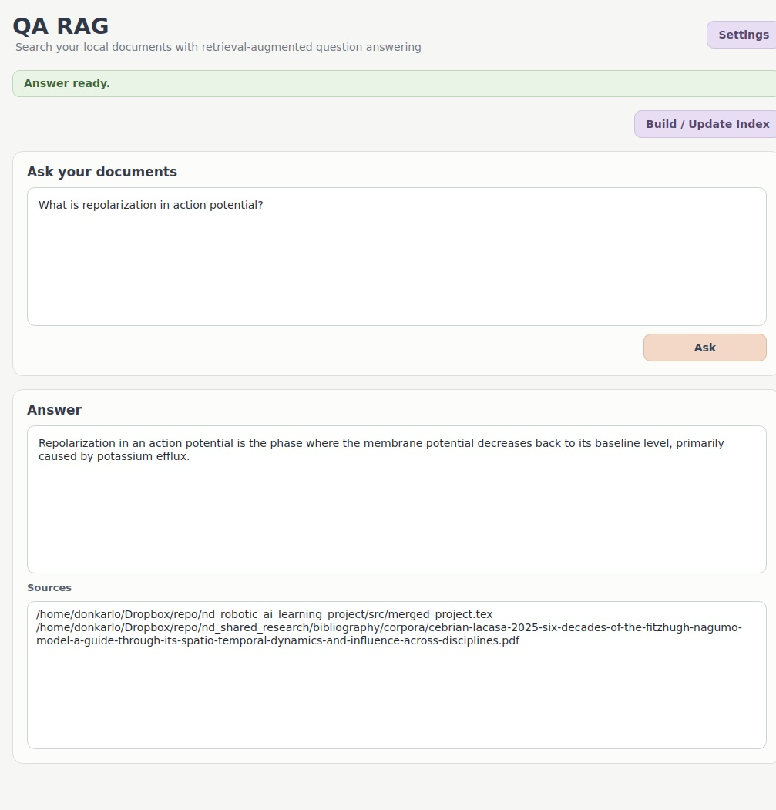
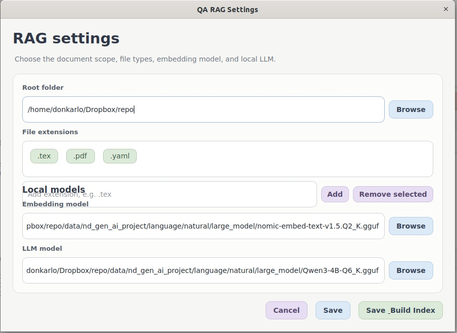

# nd_language_ai_project

## Goal

The goal of this project is to support work related to semiotics, with natural language as its most important branch. The project provides reusable interfaces and implementations for language models, embeddings, retrieval, document processing, and language/format conversion.

The broader design prioritizes the hierarchy of corpora in the file system and is intended to support structured sources such as YAML and JSON as well as ordinary text documents.

## Local RAG / QA Application
c**QA window**


**settings**


The project currently includes a local Retrieval-Augmented Generation (RAG) desktop application implemented with PySide6. It can search a selected folder tree, retrieve relevant document excerpts, and answer questions with local GGUF embedding and chat models.

### Main features

- Qt/PySide6 desktop interface with a warm visual theme.
- Configurable root folder for the document corpus.
- Extension tags control exactly which file types are considered by the index.
- Typical text formats such as `.tex`, `.yaml`, `.yml`, `.json`, `.txt`, `.md`, `.py`, etc. can be indexed when selected.
- PDF text extraction is supported, using `pdftotext` when available and Python PDF readers as fallback.
- Configurable embedding-model and chat-model paths through the Settings dialog.
- The selected root folder, extension tags, embedding model path, and chat model path are persisted between runs.
- The question box, answer area, and source list remain visible in one window.
- Answers are streamed from the local LLM.
- Retrieved source file paths are shown with the generated answer.
- Retrieval and answer-generation stages report timing information in the UI.
- Bounded in-memory caches reuse exact previous embedding/retrieval work when possible.

### Manual indexing

Indexing is intentionally **not started automatically at application startup**.

Use **Build / Update Index** when you want to create or refresh the index. This avoids a large repository scan simply because the application was opened.

If a usable cache already exists for the current root folder and extension set, it can be used immediately without rebuilding everything.

### Incremental indexing

The index is persistent and incremental.

For each indexed file the system records its path, modification time, and size. On a later update:

- unchanged files are reused from the existing cache;
- new files are indexed;
- modified files are re-read and replaced;
- files no longer belonging to the active scope are removed from the active index;
- unchanged files that previously failed or stalled are not retried on every application restart.

This makes later updates much cheaper than the first full build.

### Persistent disk cache

The RAG index uses one SQLite database:

```text
~/.cache/nd_language_ai_project/rag_index.sqlite3
```

SQLite may temporarily create the normal sidecar files:

```text
rag_index.sqlite3-wal
rag_index.sqlite3-shm
```

The application does not intentionally create a new cache database for every build. New indexing work updates/replaces data in the same persistent index. Incompatible or unusable cache schemas are removed instead of being accumulated indefinitely.

The current FTS schema uses SQLite FTS5 with an external content table so the complete chunk text is not stored twice merely to support lexical search.

SQLite is used for persistent document/chunk storage, file metadata, incremental-index state, and FTS5/BM25 lexical retrieval. It is not being used as a vector database in the current desktop implementation.

### Retrieval pipeline

Retrieval is hybrid rather than purely semantic.

1. An exact-question retrieval cache is checked for a reusable result from the current application session.
2. SQLite FTS5/BM25 finds lexical candidates when there is no retrieval-cache hit.
3. The question is embedded with the configured local embedding model.
4. Only the small lexical candidate set is embedded/reranked semantically.
5. Lexical and semantic signals are combined.
6. The highest-ranked document chunks are passed to the chat model.

The current score combines approximately:

- 35% lexical relevance;
- 65% semantic similarity.

This avoids pre-computing and storing embeddings for every chunk while still benefiting from semantic reranking.

### In-memory performance caches

The answer path includes bounded RAM-only caches intended to reduce repeated work without changing retrieval quality.

- Exact question embeddings can be reused during the same application session.
- Exact candidate batches can reuse the embedding vectors previously produced for the same batch.
- The final retrieval result for the exact same question can be reused during the same session.
- Retrieval-result caches are invalidated when the index scope/content is updated so stale document results are not reused.
- The caches are bounded and exist only in RAM; closing the application removes them.
- No additional vector cache/database is written to disk by these optimizations.

These caches reuse previously computed results exactly. They do not approximate vectors, change similarity calculations, or alter the retrieval ranking formula.

### Quality-preserving performance policy

The recent speed optimizations intentionally leave answer-quality parameters unchanged. In particular, performance caching does **not** change:

```text
retrieval candidates:       8
final top-k:                 4
context chunks to LLM:       2
lexical/semantic weights: 35/65
chat context size:        2048
chat max tokens:           256
```

The configured embedding/chat models, temperature, top-p, repeat penalty, and prompt behavior are also unchanged by the RAM-cache optimization.

### Performance instrumentation

The UI reports elapsed time for major answer stages so slowdowns can be localized without guessing. Depending on cache hits and the active model, status messages can include:

```text
Lexical search
Query embedding
Candidate embedding
Retrieval total
Retrieval RAM cache hit
Embedding RAM cache hit
LLM time-to-first-token
Answer complete / total time
```

This helps distinguish retrieval/embedding latency from local LLM generation latency.

### Cancellation and system load

Indexing is designed to be cancellable.

- File processing is intentionally conservative and processes one document at a time in the current implementation so a large build does not monopolize the whole computer.
- External PDF/text reader subprocesses are polled for cancellation and are terminated/killed when necessary.
- SQLite write/finalization operations install a progress handler so long SQL operations can also be interrupted.
- Cancelling does not run an expensive finalization step merely to stop the build.

Large first-time indexes can still take substantial time, especially when the root folder contains many large PDFs or large generated text/YAML files. Later incremental updates should normally be much faster.

### Failed or stalled files

Unreadable, malformed, very slow, or unsupported documents can be marked as failed/stalled without making the entire corpus unusable. Their file signatures are stored so unchanged problem files do not have to be retried on every restart.

Changing such a file causes it to become eligible for indexing again on the next manual update.

## Default RAG configuration

The current defaults are defined in:

```text
src/nd_language_ai/natural/large_model/rag/application_config.py
```

Important defaults include:

```text
chunk size:              1400 characters
chunk overlap:            250 characters
retrieval candidates:       8
final top-k:                 4
context chunks to LLM:       2
chat context size:        2048
chat max tokens:           256
```

The default selected extensions are:

```text
.tex
.pdf
```

Other extensions can be added or removed from the GUI.

## Models

The RAG application currently uses local llama.cpp-compatible GGUF models.

Default embedding model:

```text
<repo>/data/nd_gen_ai_project/language/natural/large_model/nomic-embed-text-v1.5.Q2_K.gguf
```

Default chat model:

```text
<repo>/data/nd_gen_ai_project/language/natural/large_model/Qwen3-4B-Q6_K.gguf
```

Both paths are configurable from the application Settings dialog, so different compatible local models can be selected without changing source code.

The current chat backend suppresses model thinking output and streams only the visible final answer.

## Settings persistence

RAG UI settings are stored outside the source tree at:

```text
<repo>/data/nd_language_ai_project/rag_settings.yaml
```

This includes the last selected root folder, extension tags, embedding-model path, and chat-model path.

## Installation

The RAG optional dependencies are declared in `pyproject.toml`:

```bash
pip install -e ".[rag]"
```

The RAG extras currently include:

- PySide6
- pypdf
- numpy
- llama-cpp-python

Having the system `pdftotext` executable available is recommended for faster/more robust PDF extraction, but Python PDF extraction is also available as fallback.

## Running the RAG application

After installing the project and RAG dependencies:

```bash
rag
```

It can also be run directly from the repository root:

```bash
python src/nd_language_ai/natural/large_model/rag/run.py
```

A normal workflow is:

1. Open **Settings**.
2. Select the root corpus folder.
3. Add only the extensions that should participate in retrieval.
4. Select the embedding and chat GGUF models if the defaults are not desired.
5. Click **Build / Update Index**.
6. Wait for a usable index, or cancel if needed.
7. Ask questions in the question box.
8. Inspect the answer, timing status, and source paths.

Once a valid index exists, reopening the application does not automatically launch another full build. Use **Build / Update Index** explicitly when the corpus should be refreshed.

## Performance notes

The first index build over a very large repository can be expensive because every selected document must be discovered, read, chunked, and inserted into the lexical index at least once.

Subsequent builds are incremental and should normally process only changed/new files.

For answers, repository size primarily affects the persistent index and lexical search; an already-built index does not re-read every PDF/TEX/YAML file for every question. The current retrieval path narrows the corpus to a small lexical candidate set before semantic reranking.

Repeated questions or repeated exact candidate batches can be faster during the same application session because their previous embedding/retrieval results can be reused from RAM.

Answer generation speed still depends heavily on the selected local LLM, quantization, CPU, available RAM, llama.cpp configuration, and context length. If timing shows that most latency occurs after retrieval and before/while tokens are generated, optimizing the retrieval backend alone will not remove that LLM-generation cost.

## RAG package layout

```text
src/nd_language_ai/natural/large_model/rag/
├── application.py
├── application_config.py
├── run.py
├── rag_settings.py
├── rag_settings_repository.py
├── document/
│   ├── file_crawler.py
│   ├── text_document_reader.py
│   └── pdf_document_reader.py
├── model/
│   ├── language_model.py
│   └── llama_cpp_language_model.py
├── retrieval/
│   ├── chunker.py
│   ├── embedding_model.py
│   ├── llama_cpp_embedding_model.py
│   ├── cached_llama_cpp_embedding_model.py
│   ├── hybrid_index.py
│   ├── persistent_hybrid_index.py
│   └── timed_persistent_hybrid_index.py
├── service/
│   ├── rag_service.py
│   ├── persistent_rag_service.py
│   └── rag_service_factory.py
└── ui/
    ├── rag_main_window.py
    ├── rag_cancelable_main_window.py
    ├── rag_settings_dialog.py
    ├── extension_tag_widget.py
    ├── index_worker.py
    └── ask_worker.py
```

## Agentic RAG

The agentic RAG subpackage is intended to support goal-directed workflows in which members/agents can be assigned goals and iteratively work toward them.

## Vector databases

The project provides abstractions intended to make it possible to work with different vector/retrieval backends without coupling higher-level code to a single vendor-specific interface.

The current desktop RAG deliberately uses SQLite/FTS5 plus on-demand semantic reranking rather than requiring an external vector database. SQLite remains useful for persistent document text, file metadata, incremental indexing, and BM25 retrieval even if a vector index is introduced later.

FAISS is a possible future local vector-search extension if profiling shows that semantic candidate embedding is the dominant bottleneck and the additional persistent vector storage/build cost is justified. Milvus is not currently required for this single-user local desktop architecture.

## Language Conversion

The project develops conversion tools between languages and document/data formats, for example converting structured YAML content into LaTeX-oriented representations.

## Compiling corpora

The project also contains functionality for compiling file hierarchies into larger source corpora. One example is gathering related source files into a single `.tex` document suitable for further processing or compilation.
